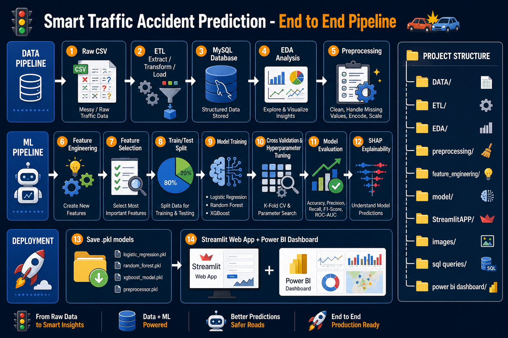
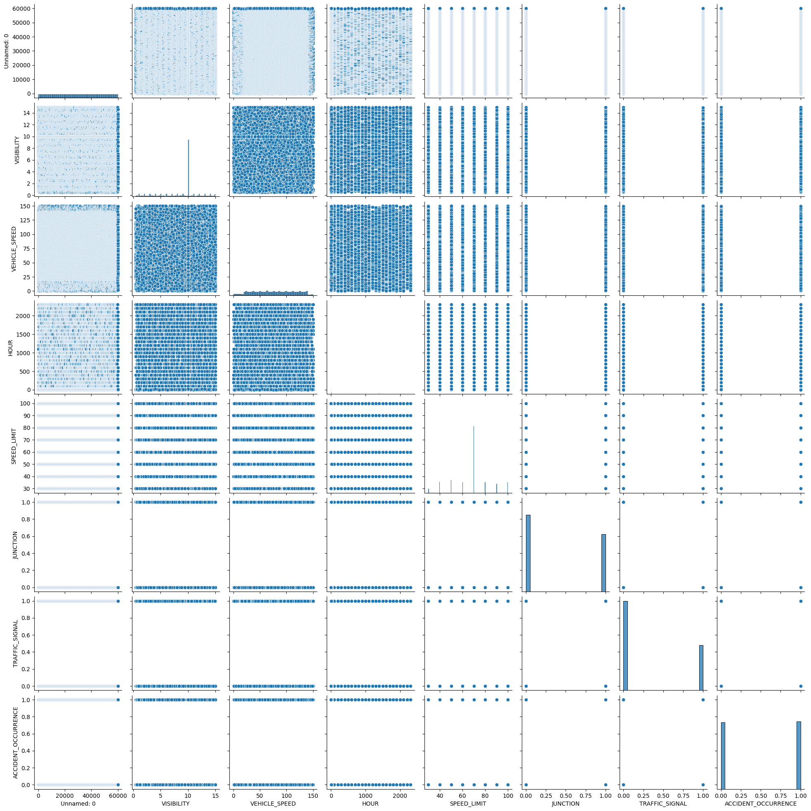
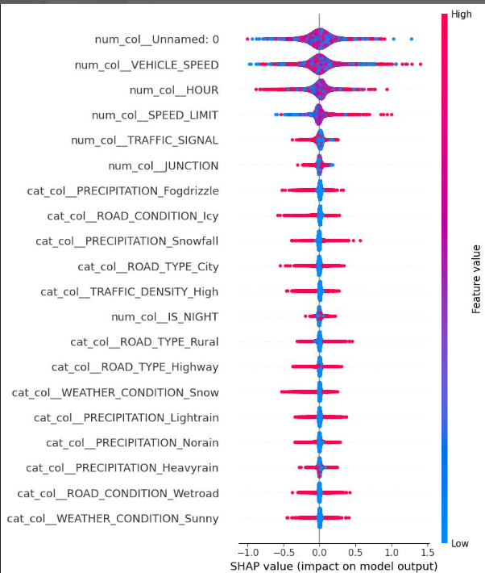

# Smart-Traffic-Accident-Prediction-using-Machine-Learning# 🚦 Smart Traffic Accident Risk Prediction System Using Machine Learning



This project predicts **traffic accident risk** using Machine Learning. We collected messy real-world traffic data, cleaned it with an **ETL pipeline**, stored it in **MySQL**, and analyzed it with **EDA** and **SQL queries**.

Then we built ML models — **Logistic Regression**, **Random Forest**, and **XGBoost** — with feature engineering, cross-validation, hyperparameter tuning, and **SHAP explainability**.

Finally, we deployed everything as a **Streamlit web app** for live predictions and a **Power BI dashboard** for visual analytics.

**Input:** weather, speed, visibility, road type, traffic density, hour  
**Output:** Low Risk ✅ or High Risk ⚠️ with a probability score

---

## 📌 Table of Contents

- [Project Overview](#-project-overview)
- [Complete Folder Structure](#-complete-folder-structure)
- [End-to-End Step Flow](#-end-to-end-step-flow)
- [When to Run Each Step](#-when-to-run-each-step)
- [How to Run (Quick Start)](#-how-to-run-quick-start)
- [Detailed Step-by-Step Guide](#-detailed-step-by-step-guide)
- [Models Used](#-models-used)
- [Features Used for Prediction](#-features-used-for-prediction)
- [Project Screenshots & Images](#-project-screenshots--images)
- [Technologies Used](#-technologies-used)
- [About Developer](#-about-developer)

---

## 🎯 Project Overview

This project builds an **intelligent traffic accident risk prediction system** using Machine Learning.

| Input | Output |
|-------|--------|
| Weather, visibility, traffic density, vehicle speed, road type, hour, etc. | **Low Risk** ✅ or **High Risk** ⚠️ + probability score |

**Goal:** Help improve road safety by identifying high-risk driving conditions before accidents happen.

---

## 📁 Complete Folder Structure

```
-Smart-Traffic-Accident-Risk-Prediction-System-Using-Machine-Learning/
│
├── 📄 README.md                          ← You are here
├── 📄 requirements.txt                   ← Python dependencies
│
├── 📂 DATA/                              ← All datasets
│   ├── messy_smart_traffic_accident_dataset.csv   ← Raw messy input (60K rows)
│   ├── cleaned_smart_accident.csv                 ← Cleaned data after ETL
│   └── feature_engineering.csv                    ← Final ML-ready dataset
│
├── 📂 ETL/                               ← Extract → Transform → Load
│   ├── Extract.py                        ← Load raw CSV
│   ├── Transform.ipynb                   ← Clean & standardize messy data
│   └── Load.py                           ← Upload cleaned data to MySQL
│
├── 📂 sql queries/
│   └── sql.sql                           ← 10 SQL analytics queries for MySQL
│
├── 📂 EDA/
│   └── EDA.ipynb                         ← Exploratory Data Analysis & charts
│
├── 📂 preprocessing/
│   └── preprocessing.ipynb               ← Encoding, scaling, missing values
│
├── 📂 feature_engineering/
│   ├── FE.ipynb                          ← Create new features (RISK_SCORE, etc.)
│   ├── feature_engineering.csv
│   └── Smart_traffic_accident_prediction_using_ML.xlsx
│
├── 📂 feature_selection/
│   └── code.ipynb                        ← Select best features for ML
│
├── 📂 model split/
│   └── split code.ipynb                  ← Train / Test split (80-20)
│
├── 📂 model_traning/
│   └── train.ipynb                       ← Train Logistic, RF, XGBoost
│
├── 📂 corss_validation/
│   └── cv.ipynb                          ← Cross-validation scores
│
├── 📂 hyper parameter/
│   └── hp.ipynb                          ← GridSearchCV tuning
│
├── 📂 model _evaluction/
│   └── model_evaluction.ipynb            ← Accuracy, F1, ROC-AUC, Confusion Matrix
│
├── 📂 explainability(SHAP)/
│   └── SHAP.ipynb                        ← Explainable AI — feature importance
│
├── 📂 model/                             ← Saved models + deployment files
│   ├── full_model_code.ipynb             ← Full pipeline in one notebook
│   ├── app.py                            ← Streamlit app (copy)
│   ├── logistic_regression.pkl           ← Saved model
│   ├── random forest classification.pkl  ← Saved model
│   ├── xgboost.pkl                       ← Saved model
│   ├── preprocessing.pkl                 ← Saved preprocessor
│   └── shap.png                          ← SHAP visualization
│
├── 📂 StreamlitAPP/                      ← 🚀 Main web app (run this!)
│   └── app.py
│
├── 📂 power bi dashboard/
│   └── Smart Traffic Accident Prediction Using Machine Learning.pbix
│
└── 📂 images/                            ← All project screenshots & charts
    ├── project_structure_thumbnail.png   ← 📌 Pipeline overview image
    ├── bar.png
    ├── corr.png
    ├── feature selection 1.png
    ├── feature selection 2.png
    ├── featureselection 3.png
    ├── output.png
    ├── Relation plot.png
    └── Screenshot *.png                  ← App & dashboard screenshots
```

---

## 🔄 End-to-End Step Flow

```
┌─────────────────────────────────────────────────────────────────────────────┐
│                        PHASE 1 — DATA PIPELINE                              │
└─────────────────────────────────────────────────────────────────────────────┘

  📥 Raw CSV                🧹 ETL                    🗄️ MySQL
  (messy data)    ──────►   Extract.py         ──────►  Load.py
                            Transform.ipynb            sql.sql queries
                                   │
                                   ▼
                          cleaned_smart_accident.csv
                                   │
                                   ▼
                          📊 EDA.ipynb  (understand patterns)
                                   │
                                   ▼
                          🔧 preprocessing.ipynb  (encode + scale)

┌─────────────────────────────────────────────────────────────────────────────┐
│                     PHASE 2 — MACHINE LEARNING PIPELINE                     │
└─────────────────────────────────────────────────────────────────────────────┘

  feature_engineering.csv  ◄──  FE.ipynb  (create RISK_SCORE, IS_NIGHT, etc.)
           │
           ▼
  feature_selection/code.ipynb  (pick important columns)
           │
           ▼
  model split/split code.ipynb  (80% train / 20% test)
           │
           ▼
  model_traning/train.ipynb  (Logistic Regression | Random Forest | XGBoost)
           │
           ├──► corss_validation/cv.ipynb
           ├──► hyper parameter/hp.ipynb  (GridSearchCV)
           └──► model _evaluction/model_evaluction.ipynb
                       │
                       ▼
           explainability(SHAP)/SHAP.ipynb  (why model predicts risk)
                       │
                       ▼
           💾 Save .pkl files  →  model/ folder

┌─────────────────────────────────────────────────────────────────────────────┐
│                     PHASE 3 — DEPLOYMENT & VISUALIZATION                    │
└─────────────────────────────────────────────────────────────────────────────┘

  StreamlitAPP/app.py  ──►  🌐 Live web prediction app
  power bi dashboard/  ──►  📈 Interactive BI dashboard
  images/              ──►  📸 Charts, EDA plots, app screenshots
```

---

## ⏱️ When to Run Each Step

| Step | Folder / File | When to Run | Who Runs It |
|------|---------------|-------------|-------------|
| **1** | `ETL/Extract.py` | First — load raw data | Data Engineer / You |
| **2** | `ETL/Transform.ipynb` | After Extract — clean messy data | Data Engineer / You |
| **3** | `ETL/Load.py` | After Transform — push to MySQL | Data Engineer / You |
| **4** | `sql queries/sql.sql` | After Load — run analytics in MySQL Workbench | Analyst / You |
| **5** | `EDA/EDA.ipynb` | After cleaning — explore data visually | Data Analyst / You |
| **6** | `preprocessing/preprocessing.ipynb` | Before ML — encode & scale features | ML Engineer / You |
| **7** | `feature_engineering/FE.ipynb` | After preprocessing — create new features | ML Engineer / You |
| **8** | `feature_selection/code.ipynb` | Before training — reduce features | ML Engineer / You |
| **9** | `model split/split code.ipynb` | Before training — split data | ML Engineer / You |
| **10** | `model_traning/train.ipynb` | Core step — train all 3 models | ML Engineer / You |
| **11** | `corss_validation/cv.ipynb` | After training — validate stability | ML Engineer / You |
| **12** | `hyper parameter/hp.ipynb` | After CV — tune best hyperparameters | ML Engineer / You |
| **13** | `model _evaluction/model_evaluction.ipynb` | After tuning — final metrics | ML Engineer / You |
| **14** | `explainability(SHAP)/SHAP.ipynb` | After evaluation — explain predictions | ML Engineer / You |
| **15** | `model/full_model_code.ipynb` | Optional — run full pipeline in one notebook | ML Engineer / You |
| **16** | `StreamlitAPP/app.py` | **Final step — deploy & predict live** | End User / You |
| **17** | `power bi dashboard/*.pbix` | After SQL Load — open in Power BI Desktop | Analyst / You |

> 💡 **Tip:** If models (`.pkl` files) already exist in `model/`, you can skip steps 1–15 and go directly to **Step 16** to run the Streamlit app.

---

## 🚀 How to Run (Quick Start)

### Prerequisites

- Python 3.9+
- MySQL Workbench (optional — for SQL step)
- Power BI Desktop (optional — for dashboard)

### 1️⃣ Install Dependencies

```bash
cd "-Smart-Traffic-Accident-Risk-Prediction-System-Using-Machine-Learning"
pip install -r requirements.txt
```

### 2️⃣ Run the Streamlit Web App (Main Demo)

```bash
cd model
streamlit run app.py
```

> **Note:** Copy model files (`.pkl`) and images into the same folder where you run Streamlit, OR run from the `model/` folder where all `.pkl` files already exist.

**Alternative — run from StreamlitAPP folder:**

```bash
# First copy model files to StreamlitAPP/
copy model\*.pkl StreamlitAPP\
copy model\*.png StreamlitAPP\
copy model\*.jpg StreamlitAPP\
cd StreamlitAPP
streamlit run app.py
```

### 3️⃣ Open in Browser

Streamlit opens automatically at: **http://localhost:8501**

---

## 📋 Detailed Step-by-Step Guide

### Step 1 — 📥 Extract Raw Data

**File:** `ETL/Extract.py`

```bash
python ETL/Extract.py
```

**What it does:** Reads `DATA/messy_smart_traffic_accident_dataset.csv` (~60,000 rows of messy traffic data).

---

### Step 2 — 🧹 Transform & Clean Data

**File:** `ETL/Transform.ipynb`

Open in Jupyter / VS Code and run all cells.

**What it does:**
- Fixes inconsistent text (e.g., `SUNNY__`, `H!GH`, `??115`)
- Standardizes weather, road, traffic columns
- Converts speed, hour, visibility to numeric
- Saves → `DATA/cleaned_smart_accident.csv`

---

### Step 3 — 🗄️ Load to MySQL

**File:** `ETL/Load.py`

```bash
python ETL/Load.py
```

**What it does:** Loads cleaned CSV into MySQL database `public`, table `smart`.

> ⚠️ Update MySQL credentials in `Load.py` before running.

---

### Step 4 — 📊 SQL Analytics

**File:** `sql queries/sql.sql`

Open in **MySQL Workbench** and run queries.

**10 Tasks included:**
1. Top 5 weather conditions with most accidents
2. Average vehicle speed during accidents
3. Accidents by traffic density
4. Top 3 road conditions with most accidents
5. Average visibility by weather during accidents
6. Accident count by hour
7. Top 5 road types by avg speed during accidents
8. Accident percentage by weather
9. Low visibility accident count
10. Weather conditions above average accident rate

---

### Step 5 — 🔍 Exploratory Data Analysis

**File:** `EDA/EDA.ipynb`

**What it does:** Visualizes distributions, correlations, and accident patterns.

**Output images saved in:** `images/` folder

---

### Step 6 — 🔧 Preprocessing

**File:** `preprocessing/preprocessing.ipynb`

**What it does:**
- Handles missing values
- Label encoding for categorical columns
- Feature scaling
- Saves preprocessor → `preprocessing.pkl`

---

### Step 7 — ⚙️ Feature Engineering

**File:** `feature_engineering/FE.ipynb`

**New features created:**

| Feature | Description |
|---------|-------------|
| `RISK_SCORE` | Target variable (accident occurrence) |
| `SPEED_RISK` | Speed limit ÷ vehicle speed ratio |
| `LOW_VISIBILITY` | 1 if visibility < 3, else 0 |
| `IS_NIGHT` | 1 if hour ≥ 20 or ≤ 5 |
| `HIGH_TRAFFIC` | 1 if traffic density is high/jam-packed |

**Output:** `DATA/feature_engineering.csv`

---

### Step 8 — 🎯 Feature Selection

**File:** `feature_selection/code.ipynb`

**What it does:** Selects most important features using statistical methods.


---

### Step 9 — ✂️ Train-Test Split

**File:** `model split/split code.ipynb`

**What it does:** Splits data into 80% training and 20% testing sets.

---

### Step 10 — 🤖 Model Training

**File:** `model_traning/train.ipynb`

**Models trained:**

| Model | File Saved |
|-------|-----------|
| Logistic Regression | `logistic_regression.pkl` |
| Random Forest | `random forest classification.pkl` |
| XGBoost | `xgboost.pkl` |

---

### Step 11 — ✅ Cross Validation

**File:** `corss_validation/cv.ipynb`

**What it does:** Validates model performance across multiple data folds.

---

### Step 12 — 🔧 Hyperparameter Tuning

**File:** `hyper parameter/hp.ipynb`

**What it does:** Uses `GridSearchCV` to find best model parameters.

---

### Step 13 — 📈 Model Evaluation

**File:** `model _evaluction/model_evaluction.ipynb`

**Metrics used:**
- ✅ Accuracy
- ✅ Precision
- ✅ Recall
- ✅ F1 Score
- ✅ ROC-AUC Score
- ✅ Confusion Matrix



---

### Step 14 — 🔬 SHAP Explainability

**File:** `explainability(SHAP)/SHAP.ipynb`

**What it does:** Explains which features most influence accident predictions.



---

### Step 15 — 💾 Save Models

**File:** `model/full_model_code.ipynb`

Saves all trained models and preprocessor as `.pkl` files in `model/` folder.

---

### Step 16 — 🌐 Streamlit Web App (Final Deployment)

**File:** `StreamlitAPP/app.py` or `model/app.py`

```bash
cd model
streamlit run app.py
```

**App Tabs:**

| Tab | What You See |
|-----|-------------|
| 🏠 Welcome Page | Project banner image |
| 📖 About Project | Full workflow description |
| 📝 User Input | Enter traffic conditions → get prediction |
| 📊 Visualization | Charts from feature_engineering.csv |
| 👨‍💻 About Developer | Developer info & links |

**How to predict:**
1. Select model from sidebar (Logistic / Random Forest / XGBoost)
2. Go to **User Input** tab
3. Fill in: vehicle speed, hour, weather, traffic density, etc.
4. Click **Predict Accident Risk**
5. See result: ✅ Low Risk or ⚠️ High Risk + risk score

---

### Step 17 — 📊 Power BI Dashboard

**File:** `power bi dashboard/Smart Traffic Accident Prediction Using Machine Learning.pbix`

Open in **Power BI Desktop** → connect to MySQL `public.smart` table → explore interactive dashboard.


---

## 🤖 Models Used

| # | Model | Type | Use Case |
|---|-------|------|----------|
| 1 | Logistic Regression | Linear classifier | Fast baseline predictions |
| 2 | Random Forest | Ensemble tree model | Handles non-linear patterns |
| 3 | XGBoost | Gradient boosting | Best accuracy performance |

---

## 📝 Features Used for Prediction

| Category | Features |
|----------|----------|
| 🌦️ Weather | `WEATHER_CONDITION`, `PRECIPITATION`, `VISIBILITY` |
| 🚗 Traffic | `TRAFFIC_DENSITY`, `VEHICLE_SPEED`, `SPEED_LIMIT`, `HIGH_TRAFFIC` |
| 🛣️ Road | `ROAD_CONDITION`, `ROAD_TYPE`, `JUNCTION`, `TRAFFIC_SIGNAL` |
| 🕐 Time | `HOUR`, `IS_NIGHT` |
| ⚙️ Engineered | `LOW_VISIBILITY`, `SPEED_RISK`, `RISK_SCORE` |

---

## 🖼️ Project Screenshots & Images

| Image | Description |
|-------|-------------|
| [project_structure_thumbnail.png](images/project_structure_thumbnail.png) | 📌 Full pipeline overview |
| [bar.png](images/bar.png) | Bar chart analysis |
| [corr.png](images/corr.png) | Correlation heatmap |
| [Relation plot.png](images/Relation%20plot.png) | Feature relation plot |
| [feature selection 1.png](images/feature%20selection%201.png) | Feature selection step 1 |
| [feature selection 2.png](images/feature%20selection%202.png) | Feature selection step 2 |
| [featureselection 3.png](images/featureselection%203.png) | Feature selection step 3 |
| [output.png](images/output.png) | Model evaluation output |
| [shap.png](model/shap.png) | SHAP explainability plot |

---

## 🛠️ Technologies Used

| Category | Tools |
|----------|-------|
| 🐍 Language | Python |
| 📊 Data | Pandas, NumPy |
| 🤖 ML | Scikit-learn, XGBoost |
| 🔬 Explainability | SHAP |
| 🗄️ Database | MySQL, SQLAlchemy |
| 📈 Visualization | Matplotlib, Seaborn, Plotly, Power BI |
| 🌐 Deployment | Streamlit |
| 📓 Development | Jupyter Notebook |

---

## 👨‍💻 About Developer

**Induri Avinash Reddy**

- 🎓 B.Tech Final Year — AIML
- 📍 Guntur, India
- 🎯 Aspiring Data Scientist & ML Engineer

| Link | URL |
|------|-----|
| 🌐 Portfolio | [avinashreddy0.github.io/portfolio-website](https://avinashreddy0.github.io/portfolio-website/) |
| 📧 Email | induriavinashreddy05@gmail.com |
| 💼 LinkedIn | [Avinash Reddy Induri](https://www.linkedin.com/in/avinash-reddy-induri-4662b832a) |
| 🐙 GitHub | [avinashreddy0](https://github.com/avinashreddy0) |
| 📦 Project Repo | [Public_Transport_Delay](https://github.com/avinashreddy0/Public_Transport_Delay) |

---

## 🔮 Future Improvements

- 🌍 Real-time prediction with live traffic API
- ☁️ Cloud deployment (AWS / Azure / Streamlit Cloud)
- 📱 Mobile-friendly dashboard
- 🗺️ GPS-based risk zone mapping
- 🔔 Alert system for high-risk conditions

---

<p align="center">
  Made with ❤️ by <strong>Induri Avinash Reddy</strong> | Smart Traffic Accident Risk Prediction System 🚦
</p>
